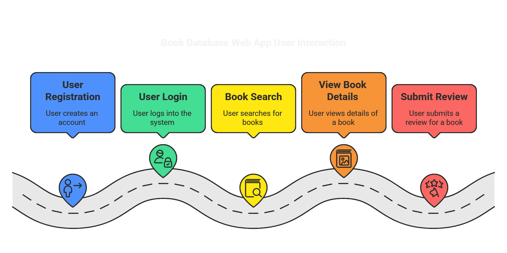

# Project 1 and 2 - Book Database Web App

## ENGO 651

## Overview
This project is a simple web application for **books database**. Users can:
- **Register** for an account
- **Log in** and **log out** securely
- **Search** for books by ISBN, title, or author
- **View book details and other additional details like average rating, rating counts,etc using google books api and summarize description using gemini api** and existing reviews
- **Submit their own reviews** for books

## Project Visual Walkthrough


## File Structure
```
BookNest/
├── application.py   # Main Flask app
├── import.py        # Script to import books from CSV into the database
├── requirements.txt # Python packages needed
├── README.md        # Project description
├── books.csv        # CSV file provided with 5000 books
├── schema.sql       # SQL file to create necessary tables (optional)
├── static/          # For CSS, JavaScript, images, etc.
├── templates/       # For HTML templates
│   ├── layout.html  # Base parent HTML file
│   ├── index.html   # Home page
│   ├── register.html # Registration page for new users
│   ├── login.html   # Login page for existing users to access the book database
│   ├── search.html  # Search books by author name, title, or ISBN
│   └── book.html    # Book details page with review submission capability
```

## Tech Stack
- **Python 3** (Flask framework)
- **PostgreSQL** (database)
- **SQLAlchemy** (for raw SQL queries and session management)
- **Bootstrap 5** (via CDN for styling)
- **SCSS** compiled into CSS for custom styles
- **HTML/Jinja2** templates

## Installation & Setup
### 1. Clone the repository
```bash
git clone https://github.com/yourusername/project1.git
cd project1-2
```

### 2. Create a virtual environment (optional but recommended)
```bash
python -m venv venv
source venv/bin/activate  # On macOS/Linux
venv\Scripts\activate     # On Windows
```

### 3. Install dependencies
```bash
pip3 install -r requirements.txt
```

### 4. Set up the database
Ensure you have PostgreSQL installed and running. Create a new database:
```sql
CREATE DATABASE book_reviews;
```
Run the schema file to create necessary tables:
```bash
psql -d book_reviews -f schema.sql
```

### 5. Import book data
```bash
python import.py
```

### 6. Run the application
```bash
python application.py
```
The application will be available at `http://127.0.0.1:5000/`.

## Features
- **User Authentication**: Register, login, and logout securely.
- **Book Search**: Search books by ISBN, title, or author.
- **Book Details Page**: View details, including existing reviews.
- **Review System**: Submit reviews for books.
- **Responsive UI**: Styled with Bootstrap 5.


## Dependencies
- [Flask](https://pypi.org/project/Flask/)
- [Flask-Session](https://pypi.org/project/Flask-Session/)
- [psycopg2-binary](https://pypi.org/project/psycopg2-binary/)
- [SQLAlchemy](https://pypi.org/project/SQLAlchemy/)
- [Werkzeug](https://pypi.org/project/Werkzeug/)

## License
This project is licensed under the MIT License. See `LICENSE` for details.

## Contact
For any inquiries, reach out to:
- **Amresh Sharma**
